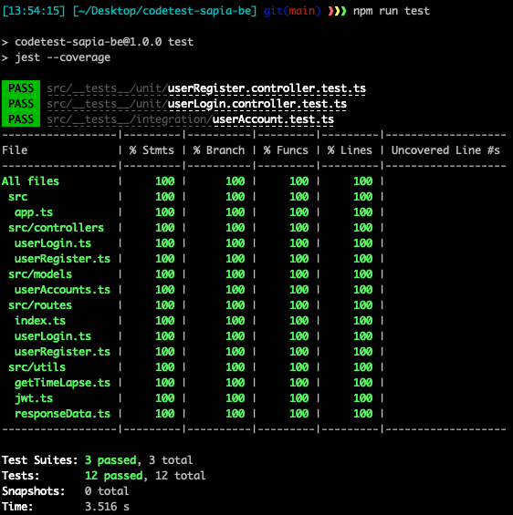
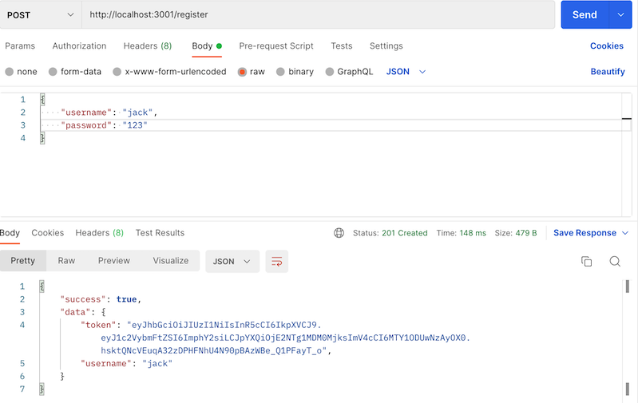
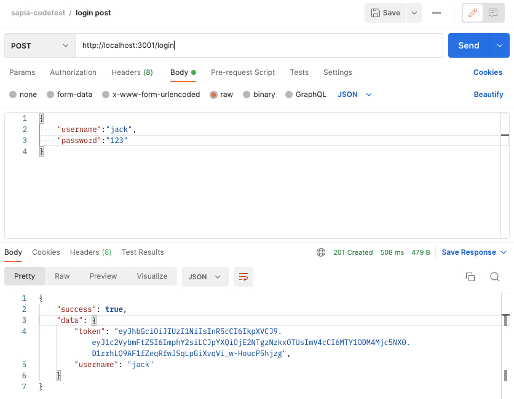
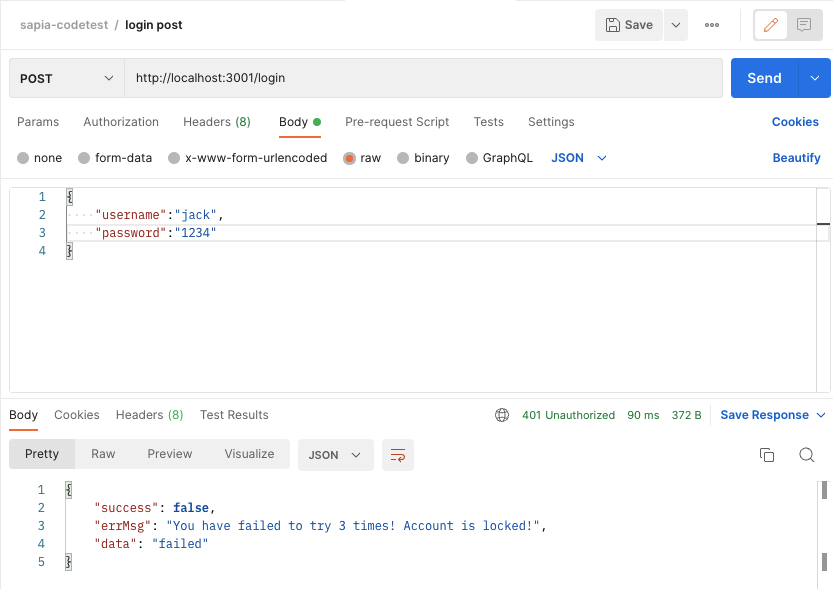
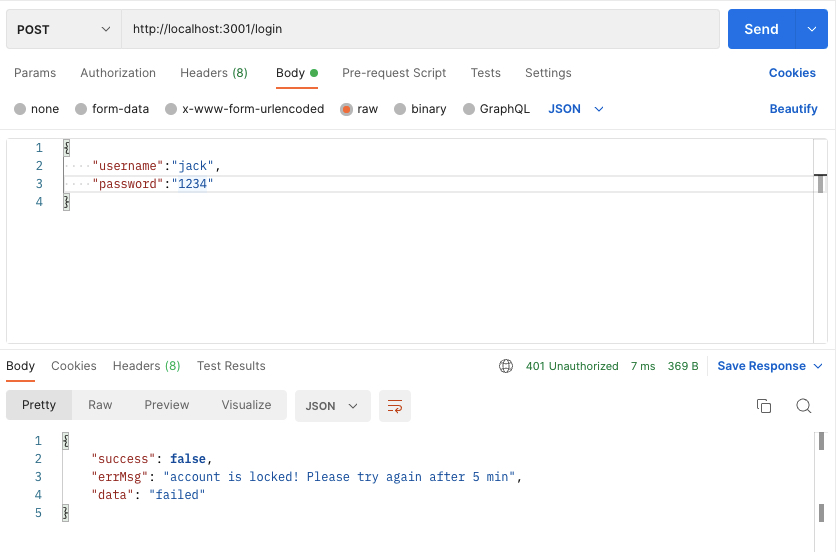
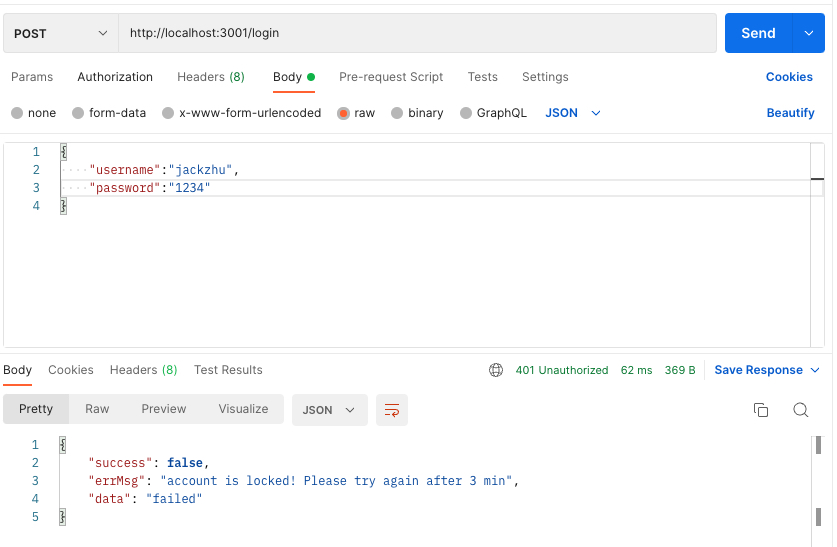
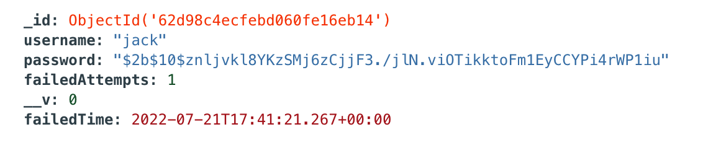

# Sapia Codetest

## About the project

This is a back-end project to meet the **User Login** requirement on Sapia's codetest. It is built with NodeJS, TypeScript, MongoDB and Docker, alongwith a bunch of third-party libraries including Jest (for testing), Express (Web app framework), Bcrypt (for password hashing) etc.

It connects to the MongoDB and provides **User Login** and **User Register** (just for the convenience for anyone who wants to login with his/her preferred username and password) features. Main user scenarios include as follows:

- User puts the right username and password, return 'success'
- User puts the username which does NOT exist:
  - return 'failed', alongside the error message: 'username does not exist!
- User puts the username which exsists:
  - User puts the wrong password less than 3 times under 5 min, return 'failed', alongside the error message: Password is wrong! Please try again!
  - User puts the wrong password which hits 3 times in 5 min, return 'failed', alongside the error message: You have failed to try 3 times! Account is locked!
  - When this particular user has been locked, no matter the password he/she puts would be right or wrong, return 'failed', alongside the error message: account is locked! Please try again after `X` min
- After 5min, the user who has been lcoked before should be unclocked, he/she can login again 🎉
<p align="right">(<a href="#top">back to top</a>)</p>

## Getting Started

After downloading this project, you can run this app by following simple steps

### Prerequisite

> For the convenience on running locally, I kept the `.env` config file in the project at the root dir

1. Docker Compose (If use Docker to run this project)

2. NPM (if run locally)

3. Node version: v16.14.0

4. MongoDB (if run locally)

### Usage

#### Option1: Run the project on Docker

Once launch the Docker, run the following command on your CLI at the dir of your project:

```sh
docker compose up
```

You will see there are two **_Containers_** created and running, which are `jack-codetest-mongo` and `jack-codetest-server`, then you can test APIs it on **Postman** (or any other API testing tool you like 😉)

#### Option2: Run the project locally

1. Install `node_modules` dependencies via command:

```sh
npm i
```

2. Start the server:

```sh
npm start
```

3. Start **MongoDB** Service

#### Test on Postman

The Port I put in `.env` (I kept it for convenience) is `3001`, so the base url is `http://localhost:3001`

There are 2 APIs `register` and `login`, both take JSON body and required keys are `username` (String) and `password` (String), example is shown below:

| HTTP Request |    API    |                   Body                   |
| :----------: | :-------: | :--------------------------------------: |
|     POST     | /register | { "username": "jack", "password": "123"} |
|     POST     |  /login   | { "username": "jack", "password": "123"} |

<p align="right">(<a href="#top">back to top</a>)</p>

### Unit/Integration test check

For checking the unit/integration testing, run this code locally simply by running the commands on the CLI at your project dir:

1. Run unit and integration testing:

```sh
npm run test
```

2. Run the project locally

```sh
npm start
```

<p align="right">(<a href="#top">back to top</a>)</p>

## What I've tested

### Test Coverage



### Register a user

**_Just take a minute to get the account you need to test Login feature after_**


### Login Succeeded



### Login Failed less than 3 times in 5 min


### Login Failed hits 3 times in 5 min

_Tell user his/her account is locked_ 😢


### Account is locked (5min / 3min)




### MongoDB document example



<p align="right">(<a href="#top">back to top</a>)</p>
